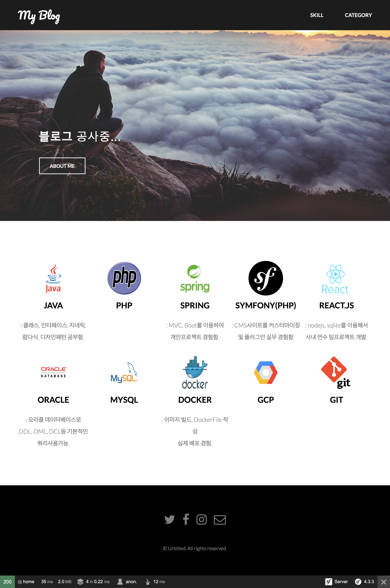

# 소개
: 개인 포트폴리오 들을 소개하기 위한 블로그<br>

 <br>

### 사용기술
```
PHP7 / 심포니(Symfony4) 프레임워크
MySQL 5.7
구글클라우드플랫폼 (GCP)
도커 컨테이너(Docker)

```
# 작업 예정
```
- 전처리 공통액션 핸들링
  1. 리턴 값(카테고리 목록) 설정.

- AccountController 
  1. 비밀번호 암호화 (SODIUM)
  2. XSS 대책
  3. 폼 액세스 토큰 설정
  4. 리팩토링

- 템플릿
  1. 헤더 확장 (로그인 / 로그아웃 버튼)
  2. 카테고리 슬라이드 (Jquery / CSS 작성) 

```
# 기록


